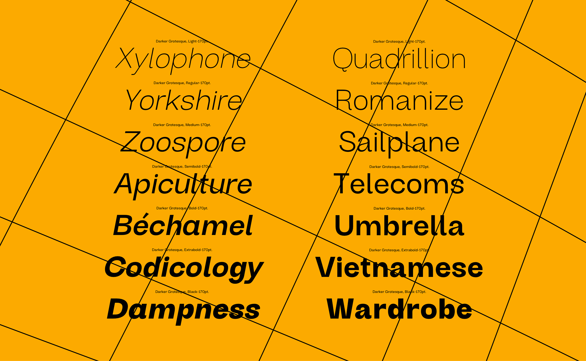
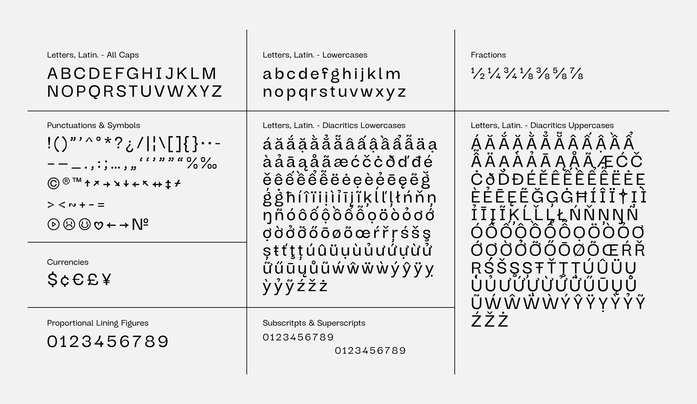

# The Darker Grotesque Project

Darker Grotesque is a contemporary grotesque designed by Gabriel Lam, inspired by the post-modern and brutalism typographic trends, the typeface was released in 2019. The complete family comes with 14 styles, including 7 weights and theirs slanted version.

## Changelog

### Version 1.000

- Make available on Github.
